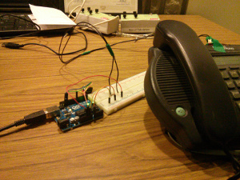

gp-voice-mail
=============

#Arduino Based Voice Mail Notification System#

##What?
MPOW has a voice mail system that only turns the message indicator LED on once voice mail has been left. No email, no sms.  This is project that uses an Arduino, Photocell, TkInter, and Pushover to send a push notification.

##Part List:
- [Button breakout](https://www.sparkfun.com/products/10467)
- [LED Button](https://www.sparkfun.com/products/10442)
- [Arduino UNO](https://www.sparkfun.com/products/11224)
- [Photocell](https://www.sparkfun.com/products/9088)
- Wire
	
	
##PreReqs
- [PySerial](https://pypi.python.org/pypi/pyserial) *Comes out of the can with Linux*
- [Python-tk](http://tkinter.unpythonic.net/wiki/How_to_install_Tkinter) *On Ubuntu apt-get install python-tk, if not already done so*
- [PushOver](https://pushover.net/) *Will also be configurable for other notification systems*
	
###NTS: Ribbon Cable Notes

- Green wire LED supply
- Blue wire LED ground
- Yellow wire Switch
- Orange wire Switch
