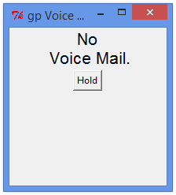
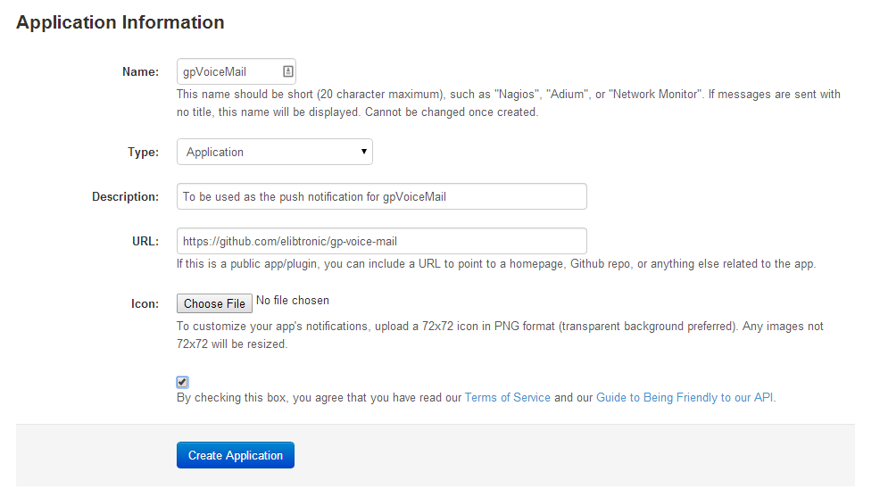

gp-voice-mail
=============

#Arduino Based Voice Mail Notification System#

##What?
MPOW has a voice mail system that only turns the message indicator LED on once voice mail has been left. No email, no sms.  This is project that uses an Arduino, Photocell, TkInter, and Pushover to send a push notification.

##Part List:
- [Button breakout](https://www.sparkfun.com/products/10467)
- [LED Button](https://www.sparkfun.com/products/10442)
- [Arduino UNO](https://www.sparkfun.com/products/11224)
- [Photocell](https://www.sparkfun.com/products/9088)
- Wire
	
	
##PreReqs
- [PySerial](https://pypi.python.org/pypi/pyserial) *Comes out of the can with Linux*
- [Python-tk](http://tkinter.unpythonic.net/wiki/How_to_install_Tkinter) *On Ubuntu apt-get install python-tk, if not already done so*
- [PushOver](https://pushover.net/) *Easy to change if you like*
	
##Config
- Register for a new PushOver App via pushover.net or modify the function singal_PO() to do whatever you'd rather the notification to go to. ie email or something
- Rename *settings.py.orig* to *setting.py.org* and add in your pushover api key and user key (familar stuff if you know pushover)
- You'll need to configure *ser* in gpVoiceMail.py, Default is for Windows and COM port 4.

##How it works
1. Arduino polls photoscell according to interval set in INO file
2. Determines if the LED on the phone is one
3. If so sends a stream of 1's down serial port
4. Python based GUI is watching Serial Port
5. Detects the stream of 1's and then triggers the pushover notification
6. Click the hold button to stop listening for voice mail, click again to toggle
7. Press and hold push button on Arduino, when LED on Arduino goes out the system has been reset

##Pics

